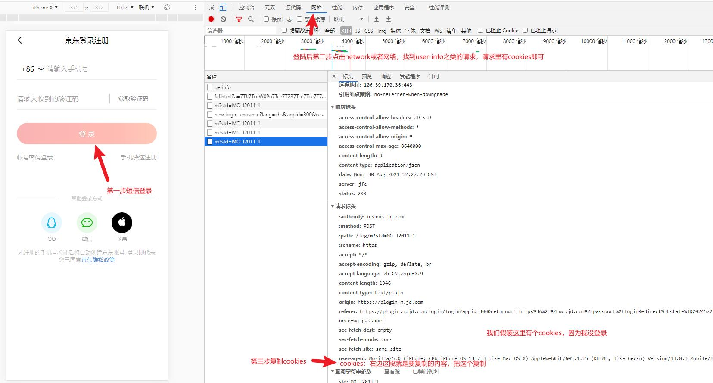

# 获取京东Cookies
> 用于学习交流！
## 步骤
获取浏览器提取cookie的方式。目前浏览器的ck有效期应该还是30天
一、手机端
①  安装alook浏览器(安卓免费，ios6元)，以下操作都在该app中完成
②浏览器访问 bean.m.jd.com 登录账号
③浏览器菜单左滑到第二页的工具箱-开发者工具-cookies 点拷贝
④只要其中的pt_key、py_pin两个字段，手动更新到数据库

方法二、电脑浏览器，使用开发者模式刷新页面后查看cookie



在控制台（console）输入这个代码（把上一步复制的ck替换下）就自动复制了

```js
var CV = `把你们的Cookies粘贴替换掉这段汉字，就会自动提取ck里的信息了，然后私发我就行`;
var CookieValue = CV.match(/pt_key=.+?;/) + CV.match(/pt_pin=.+?;/);
copy(CookieValue);
```